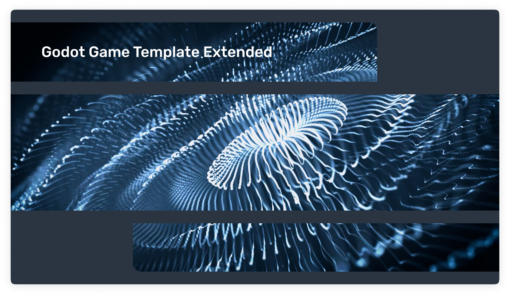

<p align="center">
   
</p>

<h3 align="center">GGTE</h3>

<p align="center">
  Boost your game development with the "Godot Game Template Extended"! Simplify intricate tasks and unleash your creative prowess with this all-encompassing template for Godot Engine 4.x.
  <br>
  <a href="https://yudinikita.itch.io/ggte"><strong>Template on Itch.io »</strong></a>
</p>

# 🎮 Godot Game Template Extended

Elevate your game development experience to unprecedented levels with the "GGTE" (Godot Game Template Extended)! This all-encompassing template is meticulously crafted for Godot Engine 4.x, aiming to streamline your game development workflow. With its user-friendly design, it simplifies complex tasks, allowing you to channel your creative energy without distractions. From project structuring to seamless debugging, exhaustive testing, and comprehensive code coverage, this template covers every aspect of game development.

Designed to empower both seasoned game development veterans and aspiring enthusiasts, the "Godot Game Template Extended" is your ultimate companion for game jams and personal projects. Embark on your game development journey with unparalleled confidence, knowing that this template has your back. Unleash your imagination and effortlessly create extraordinary games with ease and efficiency.



## 🔨 Built with

- [Godot Engine](https://github.com/godotengine/godot) - v4.x or higher
- [Release Please](https://github.com/googleapis/release-please) - streamlines the process of generating CHANGELOG, creating GitHub releases, and managing version updates
- [Godot Export](https://github.com/firebelley/godot-export) - automates the exporting of your project
- [Awesome Splash](https://github.com/duongvituan/godot-awesome-splash) - a collection of animated splash screens
- [Scene Manager](https://github.com/maktoobgar/scene_manager) - a tool for managing transitions between different scenes. Taken as a basis and refactored.
- [Credits](https://github.com/Bytezz/godot-credits) - rich credit scrolling scene. Taken as a basis and refactored.

## ✨ Features

- **Continuous Integration**

Automatically manages version changes and generates CHANGELOG. Automatically builds desktop versions for Linux, Windows, and OSX using the export_presets.cfg file. Seamlessly deploys HTML5 versions to itch.io. Creates a dedicated release branch and smoothly merges Git commits into it.

- **Scene Manager**

The Scene Manager is an invaluable asset for developers seeking to optimize scene management and enhance transitions between scenes. Its robust and adaptable tool menu structure empowers users to efficiently organize and categorize scenes, ensuring a seamless navigation experience. Enjoy the flexibility to go back to previous scenes and customize scene categories to suit your specific needs, all within an intuitive and user-friendly interface.

- **Custom Bootsplash**

Personalize your game's bootsplash by selecting either the default Godot bootsplash or creating your own unique logo bootsplashes. Customize the code and effortlessly modify the logo, title, and description to align with your vision. Take advantage of advanced animation capabilities to bring your bootsplash to life.

- **Basic Menu Navigation**

Includes a basic menu navigation system. Navigate between in-game scenes, the main menu, loading scene, confirmation panel, credits, and game pause. Enjoy transitions between ready-made standard game sections.

- **Pause and Resume Gameplay**

Enhance your gaming experience with a built-in pause feature that allows you to temporarily pause the game. Take control of the gameplay flow and easily resume where you left off with a user-friendly pause menu.

- **Game Settings**

Utilize the fine-grained control over audio levels, including master, sound, and music volumes, to ensure an immersive audio environment. Empower players to select their preferred game language, toggle fullscreen mode, and optimize performance by managing vSync. Enhance visual quality by adjusting the render scale for 3D scenes and enabling 2D and 3D anti-aliasing for smooth and polished visuals. Take advantage of these customizable game settings to create a captivating gaming experience.

- **Save Game Integration**

Implemented game state saving functionality with automatic saving upon exit. Ensure a clean slate by overriding the existing save game when starting a new game. Enable convenient autosaving and loading of settings to enhance the user experience.

- **Localization Support**

Leverage our built-in localization capabilities to easily support multiple languages in your application. Benefit from a collection of pre-defined translations that can be easily extended to accommodate additional languages. Empower your users by providing a localized experience that caters to their language preferences, enhancing accessibility and user satisfaction.

- **And more...**

This template goes beyond the mentioned features and ensures adherence to official GDScript guidelines, verified through rigorous testing with gdlint. It seamlessly integrates with other Godot addons, allowing you to leverage its functionality alongside your existing tools and extensions. With this solution, you can confidently expand your project's capabilities while maintaining code quality and compatibility with the broader Godot ecosystem.

[Video Demo](https://github.com/nblackninja/godot-game-template-extended/assets/36636599/fd93d8a8-e2fe-4734-a9db-030a91449c91)

## 📝 Getting started

### 1. Installation

1. [Create a new repo using this template](https://github.com/nblackninja/godot-game-template-extended/generate) or `Click Use` this template in Github ([learn more about Template Repositories](https://docs.github.com/en/repositories/creating-and-managing-repositories/creating-a-repository-from-a-template))
2. Clone the new repository locally
3. Open the project in Godot Engine 4
4. You're all set!

### 2. Usage

1. Customize the template according to your specific requirements and preferences.
2. Update the bootsplash to reflect your game's branding and visual style.
3. Modify the authors' information in the `project\credits.ini` file.
4. Update the version number in the `project\version.gd` file to reflect the current version of your game.
5. Open the `project\src\scenes\game_manager\game_manager.tscn` file to access the game manager scene and begin building your own unique game.

Happy coding!

### 3. Build

To build your project, follow these steps:

1. Set up the project export by referring to the instructions provided in the official documentation on [Exporting projects](https://docs.godotengine.org/en/stable/tutorials/export/exporting_projects.html).
2. Trigger an automatic export of the project by making a commit that changes the version. This will initiate the build process using the `.github\workflows\release.yml` file. The automated workflow will handle the export and create the necessary artifacts for your project.
3. Alternatively, if you prefer manual control over the build process, you can manually trigger the project build using the action located at the following path: `.github\workflows\export-dispatch.yml`. This gives you the flexibility to initiate the build whenever you choose.

## ❓ FAQ

Here you will find the most frequently asked questions relating to the project answered.

<details>
  <summary>How can I change the scene?</summary>

  To modify scenes, you can leverage the power of the `SceneManager` global class. This class provides comprehensive functionality for managing scene-related operations. For detailed instructions and usage examples, please refer to the extensive documentation available for the addon.

  ```gd
  SceneManager.change_scene(scene: String or PackedScene or Node, fade_out_options: Options, fade_in_options: Options, general_options: GeneralOptions)
  ```

</details>

<details>
  <summary>How can I change the scene using a loading scene?</summary>

  To utilize a loading scene for changing scenes, you need to create the loading scene first. Here's an example of the code to create the loading scene:

  ```gd
  extends Control

  @onready var progress: ProgressBar = find_child("Progress")
  @onready var progress_label: Label = find_child("ProgressLabel")

  func _ready():
    SceneManager.load_percent_changed.connect(Callable(self, "percent_changed"))
    SceneManager.load_finished.connect(Callable(self, "loading_finished"))
    SceneManager.load_scene_interactive(SceneManager.get_recorded_scene())

  func percent_changed(number: int) -> void:
    progress.value = number

  func loading_finished() -> void:
    loading.visible = false
    next.visible = true

  func _on_next_button_up():
    SceneManager.change_scene_to_loaded_scene(fade_out_options, fade_in_options, general_options)
  ```

</details>

<details>
  <summary>How can I skip the start bootsplash?</summary>

  By default, the start bootsplash can be skipped by clicking anywhere on the screen. This functionality is enabled by default to provide a seamless user experience. If you wish to disable the start bootsplash completely, you can customize this behavior in the project settings or the relevant code section. Make the necessary modifications to ensure that the start bootsplash is skipped without requiring any user interaction.

</details>

<details>
  <summary>How can I skip or speed up the credits?</summary>

  To skip or speed up the credits, you can utilize the keyboard arrow keys. Pressing the up arrow key will accelerate the credits, while pressing the down arrow key will slow them down. This functionality is implemented through the ui_up and ui_down events, which are initially configured in the Credits settings. If you wish to customize this behavior, you can modify the corresponding scene to define your desired key mappings or adjust the speed settings according to your preferences.

</details>

<details>
  <summary>How can I display the game's version number?</summary>

  To display the version number of your game, you can refer to the project/version.gd file. This file contains the version constants that define the current version of your game.

  Here is an example function that retrieves the game version:

  ```gd
  static func get_version() -> String:
    var v = load("res://version.gd")
    return "v{major}.{minor}.{patch}".format(
      {"major": str(v.MAJOR), "minor": str(v.MINOR), "patch": str(v.PATCH)}
    )
  ```

  By using this function, you can retrieve the game version and display it in your user interface or wherever it's needed within your game.

</details>

<details>
  <summary>Can I use this template for both 2D and 3D games?</summary>

  Of course. This template is designed to be versatile and flexible, allowing you to create both 2D and 3D games. It has intentionally been kept open-ended to support a wide range of game development needs. Whether you're working on a 2D side-scroller, a 3D action-adventure, or anything in between, this template provides a solid foundation for your game development journey. So go ahead and unleash your creativity in either 2D or 3D, the choice is yours.

</details>

## 💬 Note

If you have any suggestions or encounter any problems when using the app, please feel free to contact us by email. I am ready to help you and solve any of your problems.

## ❤️ Acknowledgments

This project drew inspiration and gained valuable insights from the following sources:

- [Godot Game Template](https://github.com/crystal-bit/godot-game-template)
- [Godot Gamejam](https://github.com/bitbrain/godot-gamejam)
- [GodotStarter](https://github.com/SebaSOFT/GodotStarter)
- [Chickensoft.GodotGame](https://github.com/chickensoft-games/GodotGame)

I express my gratitude for their contribution and influence on the development of this project.

## 🔐 License

The source code of this project is licensed under the MIT license, which can be found [here](LICENSE).

---

> nikitayudin782@gmail.com &nbsp;&middot;&nbsp;
> GitHub [@nblackninja](https://github.com/с) &nbsp;&middot;&nbsp;
> Telegram [@yudinikita](https://t.me/yudinikita)
